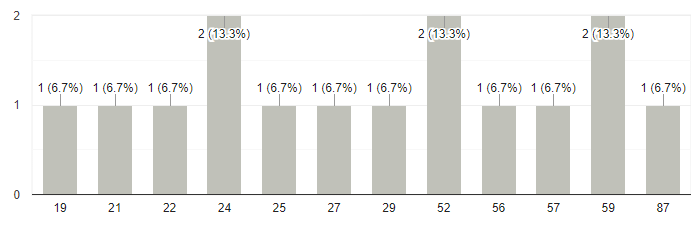

<style  style="visibility:hidden">
section {
  background: #faf4eb;
}
</style>


---


---


---


---

# Introduction 
---

### Tech Stack:

- Front-end: Next.js, Tailwind CSS, Framer Motion, tailwind-prose
- Back-end: Go (Golang)
- Database: Supabase

---

### Objective:
The primary objective of this project was to seamlessly integrate the power of Next.js for a robust and responsive front-end, Tailwind CSS for efficient styling, and Framer Motion for adding delightful motion effects. On the server side, I used the speed and efficiency of the Go programming language, while Supabase served as my dynamic and scalable database and file storage solution.

---
### Key Features:

- Sleek, modern and accessible (WAGAG) design thanks to [RealtimeColours](https://www.realtimecolors.com/?colors=e1eae7-000000-bdd0c9-080c0a-b1c8bf&fonts=Poppins-Poppins)


---


---
# Backend
---
## Overview
The backend was programmed using Go and the Gin framework as it uses simple syntax and easy to learn primitives, coming from a express.js background.

It serves the purpose of a "basic" CRUD-API Layer to the database, it does not serve the html and frontend by itself. 

---
## Core Features Implementation
My backend had the task of being there for all the Project operations and handling authorization of the user, so that only authorized user (The admin) can alter project data.

---
#### Auth-Controller
```go
func Login(c *gin.Context)
func Register(c *gin.Context)
func Status(c *gin.Context)
func CurrentUser(c *gin.Context)
```
---
#### Project-Controller
```go
func GetProjects(c *gin.Context)
func CreateProject(c *gin.Context)
func GetProjectByID(c *gin.Context)
func UpdateProject(c *gin.Context)
```
---

#### Middleware
```go
func JwtAuthMiddleware() gin.HandlerFunc {
	return func(c *gin.Context) {
		fmt.Println("jwt middleware")
		err := token.ValidateToken(c)
		if err != nil {
			fmt.Println("Middleware error: ", err)
			c.String(http.StatusUnauthorized, "Unauthorized")
			c.Abort()
			return
		}
		fmt.Println("Authorized")
		c.Next()
	}
}
```
---
#### Public Routes
```go
r.GET("/", controllers.Hey)
r.GET("/api/projects", controllers.GetProjects)
r.GET("/api/projects/:id", controllers.GetProjectByID)
r.POST("/login", controllers.Login)
r.POST("/register", controllers.Register)
```
---
#### Private Routes
```go
private := r.Group("/private")
private.Use(middlewares.JwtAuthMiddleware()) //Private routes protected by middleware
{
	private.GET("/user", controllers.CurrentUser)
	private.GET("/status", controllers.Status)
	private.POST("/createProject", controllers.CreateProject)
	private.POST("/updateProject", controllers.UpdateProject)
}
```

---
## Functionality Level
Because the API is not consumable publicly the error handling is being handled internally and a user-friendly error handling is done on the frontend.
In a real life scenario I would ditch splitting database, in favor of a full-stack solution that Next.js offers.

The database uses sqlx for type-safe SQL query to the database.


---
## Issues

Using file storage and database from Supabase requires connecting to the DB and the Storage separately, because I wanted to use SQL strings for the Database.


Before using the backend a user needs to be created in the Supabase Dashboard

---

## Complexity

<!-- - Discuss the complexity of Back-end functionality implemented.
- Evaluate if the Back-end features demonstrate sophistication. -->
The main complexity comes from the authorization layer it needs to be secure and not exploitable.

---

## Design Considerations

<!-- - Describe the design considerations taken into account during the Back-end implementation.
- Discuss how the components show a good understanding of networking concepts. -->

I chose to use raw SQL to query the data, which helps me being future proof in case I want to migrate the service to a different stack. 

The Backend layer is protected by middleware and uses JWT token instead of cookie storage to authorize users.


---
## Innovative Approaches

Due to go's concurrency it is modern and my portfolio website will be able to handle a lot of requests.

---

## Code Quality
My code follows best practices such as using structures to Marshal and unMarshal JSON data from requests, I can be confident using the Project structure because go handles filling it for me ad will error when a field is missing.

---
The codebase is structured using a fairly standard Filesystem:

- models: Definition of data and its behavior
- controllers: handling the requests (separated in ```projects.go``` and ```auth.go```)
- database: establishing Database connections and a Supabase storage connection
- and ```main.go``` defining all the routes and the corresponding controllers
  
---
# Database Implementation
---
## Overview
- Briefly introduce the purpose of the database implementation.
- Emphasize the significance of the database component in the overall project.
---

## Core Features Implementation
- Discuss the implementation of core features of the database component.
- Highlight that there are no show-stopping bugs in these core features.

---

## Functionality Level
- Assess the overall functionality level of the database demonstration.
- Discuss how the implemented features demonstrate a good level of technical ability.

---

## Issues
- Identify and discuss any minor, non-critical issues present in the database demonstration.
- Emphasize that these issues do not impede the functioning of the demonstration.

---

## Database Functionality Complexity
- Discuss the complexity of the database functionality implemented.
- Evaluate if the database features demonstrate sophistication.

---

## Design Considerations
- Describe the design considerations taken into account during the database implementation.
- Discuss how the component shows a good understanding of database concepts.

---

## Innovative Approaches
- Discuss any interesting or innovative approaches used in the database implementation.
- Evaluate how the database component implements a very good set of features.

---

## Database Code Quality
- Evaluate the quality of the code in terms of comments and structure.
- Discuss the level of commenting and the overall structure of the database code.

---

# Database Industry Standards

---
## Database Implementation Standards
- Discuss whether the database implementation adheres to industry standards.
- Evaluate the use of either SQL or NoSQL and the reasoning behind the choice.

---

## Demonstration Functionality
- Discuss the level of functionality in the demonstration.
- Emphasize that there are no issues, if any, in the demonstration.

---

# Conclusion
- Summarize the database implementation, sophistication, maintainability, and adherence to industry standards.
- Reflect on the achieved level of database functionality and the impact on the overall project.

---
# Frontend Technical Analysis

---
## Overview


---

## Architecture
Describe the architecture of your frontend application. Discuss how the project is structured and why it's structured that way.

---

## Components
Detail the key components of your frontend. This could include descriptions of important UI components, services, or libraries that you're using.

---

## Code Samples
Provide some code samples from your project that illustrate important concepts or techniques.

---

## Challenges and Solutions
Discuss any significant challenges you encountered during development and how you solved them.

---

## Future Improvements
Discuss any planned improvements or features for the frontend.

---

## Conclusion
Wrap up your documentation with a brief conclusion.

---

## References
List any resources or references used during the development of the frontend.

---
# HCI-Investigation
---

## Overview
- HCI investigation is important because it helps to design more intuitive, efficient, and user-friendly interfaces, enhancing user satisfaction and productivity.
- As it is a personal portfolio HCI is of highest importance, users should be able to navigate and interact with my site seamlessly to find all important information


---

## User Study
- I set up a google form to get valuable feedback on user experience and design
This helped me identify Problems with my design which I had not realized before, especially for different ages and backgrounds


---
## Results
---
#### Age of participants



---

#### Gender of participants


---

### Positive Feedback

- Users appreciated the clear design, ease of navigation, and overall interactivity.
- The project descriptions and details were found helpful and clear.
- The availability of both light and dark modes was well-received.

---

### Design Feedback

- Positive remarks about the design, color scheme, and icons.
- Some users suggested adding more images for a visually appealing experience.
- Recommendations for minor adjustments, like adding app names after icons.

---
#### Devices used to access the Website


---

### Navigation Feedback

- Generally positive feedback on navigation ease.
- Some users suggested improving the navigation for specific elements, like "Visit project" and "Github repository."

---

### Content Suggestions

- Requests for more personal information, background, and biography.
- Suggestions for featuring different types of projects, including animated and interactive ones.

---

### Contact Ease

- Positive feedback on ease of contacting through the portfolio website.
- Some users suggested monitoring the desktop mode and improving the visibility of social media links.

---

### Mode Preferences

- Preferences varied between light and dark modes, with no clear majority.


---

##  Implementation of Solutions

---

## Example 

The comment that made me realize: 
Create individual pages for different categories
Younger people it was easy to navigate older people found it hard to navigate and didn't even know how to use the links to different pages

---

### Before


---
### After


---

## 2nd Fix
User found that the navbar was too small

---


---


---

## Design Considerations
- Designing the website it was important for me to keep a coherent look and fee to it, thats why I reached to Tailwind CSS and a modern colour pallet


---
- The Colours are easily adjustable via the ```globals.css``` file, it makes it extendable for further adjustments if I don't feel like my Website needs a fresh colour scheme
---
## Frontend DevOps and Hosting
- I decided to use Vercel for hosting my frontend as it is the proprietary hosting service for Next.js and is highly designed about continuos integration. It produces a preview for each commit and allows me to look at older versions of my website to see if I actually improved my site.
- Vercel uses Serverless infrastructure which means it can scale in case a lot of traffic is generated, for now I will not reach the limits of the generous free tier
- Easy setup of environment variables through their dashboard
---
## Backend DevOps and Hosting
- My backend is hosted on Fly.io, it was an easy choice, as it integrates well with Golang.
- It has great Logging which helped me debugging even in Production
- Easy setup of environment variables through their dashboard
- I set up a Github action which allows me to have automatic checks and deployment on commit to have a seamless productivity
---
## Database Deployment
- Using the Supabase hosting was simple to set up
- Great for local development, because it is possible to clone the database to local development with docker including all feature lie the storage which is great because I can test on real data without damaging production data  
---
## Script for Local Development
```bash

rem
echo Starting Docker Desktop...
start "" "C:\Program Files\Docker\Docker\Docker Desktop.exe"

rem 
timeout /t 10

rem 
echo Starting Supabase...
cd C:\Users\Niklas\Documents\Uni23_24\WEB\bognar.dev-portfolio\app
start npx supabase start

rem
timeout /t 10

rem
echo Starting Go application...
cd C:\Users\Niklas\Documents\Uni23_24\WEB\bognar.dev-backend\
start cmd /k "go run main.go"

rem 
echo Starting Next.js development server...
start cmd /k "cd C:\Users\Niklas\Documents\Uni23_24\WEB\bognar.dev-portfolio && pnpm run dev"

```  
---
# Optimization Investigation

---

## Introduction
- The project underwent a comprehensive optimization investigation to enhance its overall performance.
- Performance optimization is crucial for providing users with a seamless and efficient experience, impacting factors such as page load times and user engagement.

---

## Current State
- The project initially faced challenges related to layout shifts and unnecessary renders
- Due to Next.js being a highly optimized framework performance was good out of the box, the defaults enforced by it help to get performance right first time.
- Server side rendering is generating static pages at build time which is faster then building them at run time to send them especially when the server is performing a cold start, which is important if there is low traffic
---

## Lighthouse Scores
- Introduced Lighthouse, a performance measurement tool provided by Google, to assess various aspects of the project's performance.
- Lighthouse scores provide insights into key metrics, including performance, accessibility, and adherence to best practices.

---


## Lighthouse Analysis
- Conducted a detailed analysis of Lighthouse scores for the project.
- Metrics breakdown:
  - **Performance:** Measures aspects like first contentful paint and speed index.
  - **Accessibility:** Examines the project's accessibility for all users.
  - **Best Practices:** Evaluates adherence to web development best practices.

---

## Identified Issues
- Specific issues identified through Lighthouse analysis include:
  - Layout shifts impacting user experience.
  - Opportunities for improving resource loading efficiency.
  - Accessibility enhancements needed for diverse user interactions.

---

## Profiling Tools
- Utilized profiling tools such as Chrome Developer Tools and other performance monitoring tools.
- Applied these tools to identify and analyze performance bottlenecks and areas for improvement.

---

# Implementation of Solutions

---

## Initial Solutions
- Initiated efforts to address identified issues, focusing on improving layout shifts and resource loading.
- Encountered challenges in finding optimal solutions without compromising other aspects of the project.

---

## Iterative Improvements
- Implemented iterative improvements based on feedback and ongoing testing.
- Prioritized user feedback to refine solutions and enhance the overall user experience.

---

## Final Solutions
- Presented the final set of solutions implemented, which effectively addressed the identified issues.
- Highlighted how these solutions positively impacted Lighthouse scores.

---

## Code Structure
- Discussed the importance of maintaining a high-quality code structure.
- Emphasized the significance of well-commented and readable code for long-term maintainability.

---

## Innovative Approaches
- Showcased innovative approaches employed during the optimization process.
- Examples include implementing lazy loading for images and using modern web development techniques to enhance performance.

---

## Results and Impact
- Summarized the overall impact of the optimization efforts.
- Compared Lighthouse scores before and after implementation to showcase the tangible improvements achieved.

---

## Conclusion
- Recapitulated the key aspects of the optimization journey.
- Shared key takeaways and lessons learned during the process.

---

